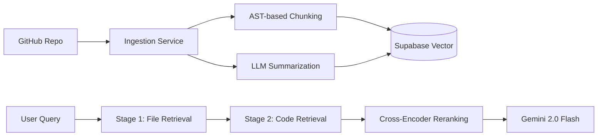

# RepoGPT 🤖 - Heavy-Duty Codebase Intelligence

[](https://nextjs.org/)
[](https://fastapi.tiangolo.com/)
[](https://deepmind.google/technologies/gemini/)
[](https://supabase.com/)
[](https://tailwindcss.com/)

**RepoGPT** is a production-grade RAG (Retrieval-Augmented Generation) and Multi-Agent Research application designed for deep codebase analysis. It enables users to ingest entire GitHub repositories, generate hierarchical summaries, and perform complex technical research using a specialized swarm of AI agents.

---

## 🚀 Key Features

- **🔍 Smart Repository Ingestion**: Clones and parses repositories using **Tree-sitter AST-based chunking** for high-precision code context.
- **🧠 Hierarchical RAG Pipeline**: A dual-stage retrieval system that utilizes file-level summaries and granular code blocks for superior accuracy.
- **🤖 Multi-Agent Research Swarm**: A sophisticated planning-executor architecture featuring:
  - **Planner Agent**: Decomposes complex queries into actionable research steps.
  - **Research Agent**: Utilizes tools like Tavily, ArXiv, and GitHub Search.
  - **Writer & Editor Agents**: Drafts and refines comprehensive technical reports.
  - **Critique Agent**: Validates output quality and ensures technical depth.
- **⚡ Optimized for Gemini 2.0**: Grounded in Google's latest Gemini 2.0 Flash for lightning-fast reasoning and massive context windows.
- **🎨 Modern UI/UX**: A sleek, responsive dashboard built with **Next.js 16**, **Tailwind CSS 4**, and **Framer Motion**.

---

## 🏗️ System Architecture

### Multi-Agent Interaction Flow


### Hierarchical RAG Pipeline


---

## 🛠️ Tech Stack

### Frontend
- **Framework**: Next.js 16 (App Router)
- **Styling**: Tailwind CSS 4 (+ PostCSS)
- **Animations**: Framer Motion
- **Icons**: Lucide React
- **Syntax Highlighting**: React Syntax Highlighter

### Backend
- **Framework**: FastAPI (Python 3.10+)
- **AI Engine**: Google GenAI (Gemini 2.0 Flash)
- **Orchestration**: Custom Multi-Agent Framework
- **Tools**: Tavily, ArXiv, Wikipedia API, GitPython
- **Database**: Supabase (PostgreSQL + pgvector)
- **Parsing**: Tree-sitter (for AST-aware chunking)

---

## ⚙️ Getting Started

### 1. Prerequisites
- Python 3.10+
- Node.js 18+
- Supabase Account (with Vector enabled)
- Google AI (Gemini) API Key

### 2. Backend Setup
```bash
cd server
# Install dependencies
pip install -r requirements.txt

# Configure Environment
cp .env.example .env
# Edit .env with your credentials:
# GOOGLE_API_KEY, SUPABASE_URL, SUPABASE_SERVICE_KEY, TAVILY_API_KEY

# Start Server
uvicorn main:app --reload
```

### 3. Frontend Setup
```bash
cd client
# Install dependencies
npm install

# Configure Environment
cp .env.example .env.local
# Edit .env.local with Supabase credentials

# Start Development Server
npm run dev
```

---

## 📂 Project Structure

```bash
RepoGPT/
├── client/           # Next.js Frontend (React + Tailwind 4)
│   ├── src/          # Components, Hooks, and App Logic
│   └── public/       # Static Assets
├── server/           # FastAPI Backend (Python)
│   ├── app/          # Core RAG & Ingestion Services
│   ├── src/          # Multi-agent Architecture (Research, Planning)
│   ├── prompts/      # Agent System Instructions
│   └── database/     # Schema and Migrations
└── README.md         # Global Documentation
```

---

## 📜 License

This project is licensed under the MIT License - see the LICENSE file for details.

---

<p align="center">
  Built with ❤️ for the Next Generation of Developers
</p>
