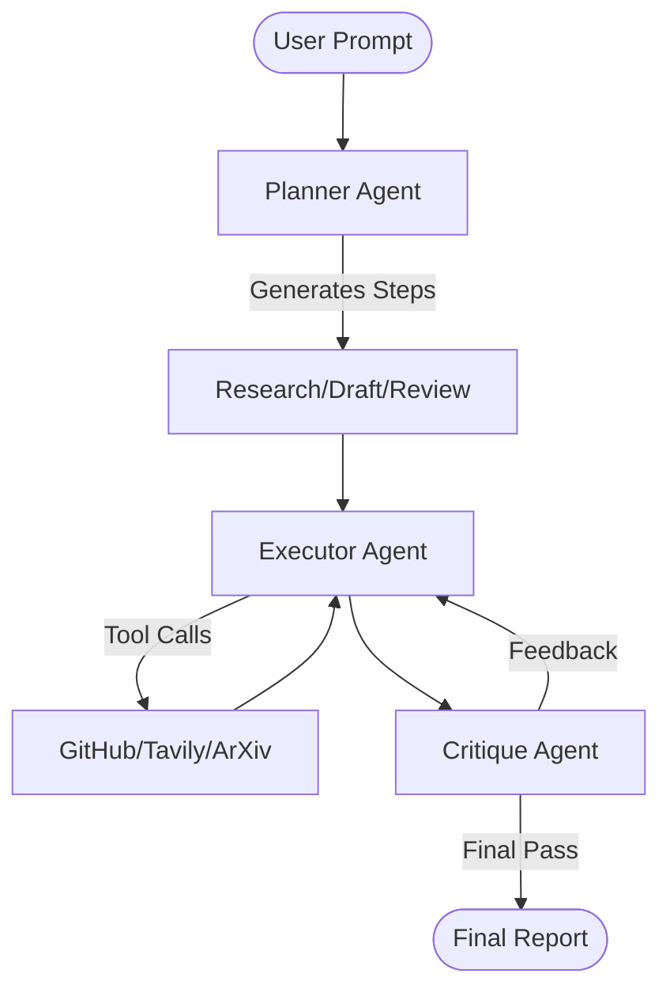
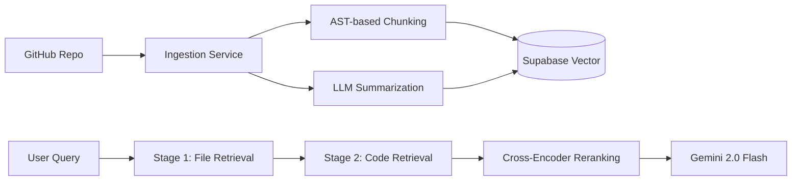

# RepoGPT 🤖

RepoGPT is a production-grade RAG (Retrieval-Augmented Generation) application designed for deep codebase analysis. It allows users to ingest GitHub repositories, summarize files, and ask technical questions with semantic search and cross-encoder reranking.

## Project Structure

```bash
RepoGPT/
├── client/           # Next.js Frontend (React + Tailwind)
├── server/           # FastAPI Backend (Python)
│   ├── app/          # Core Logic (Ingestion, RAG, Agents)
│   ├── database/     # SQL Schema files
│   ├── prisma/       # Database ORM configuration
│   ├── scripts/      # Utility & Verification scripts
│   ├── src/          # Multi-agent Research & Planning logic
│   └── main.py       # API Entry point
└── .gitignore        # Global git ignore configurations
```

## System Architecture

### Multi-Agent Flow


### Hierarchical RAG Pipeline


## Getting Started

### Backend Setup
1. Navigate to the `server` directory.
2. Install dependencies: `pip install -r requirements.txt`
3. Configure your `.env` file with `GOOGLE_API_KEY`, `SUPABASE_URL`, and `SUPABASE_SERVICE_KEY`.
4. Start the server: `uvicorn main.py --reload`

### Frontend Setup
1. Navigate to the `client` directory.
2. Install dependencies: `npm install`
3. Configure `.env.local` with Supabase credentials.
4. Start the development server: `npm run dev`

## Features
- **Smart Ingestion**: Clones and parses repositories with AST-based chunking.
- **Hierarchical RAG**: Two-stage retrieval using file summaries and code blocks.
- **Multi-Agent Research**: Uses a planning-executor architecture for broad technical research.
- **Deep Code Understanding**: Specifically optimized for Gemini 2.0 Flash.
